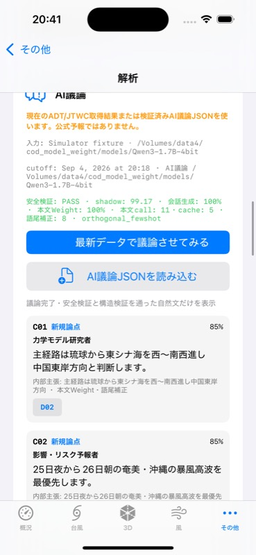
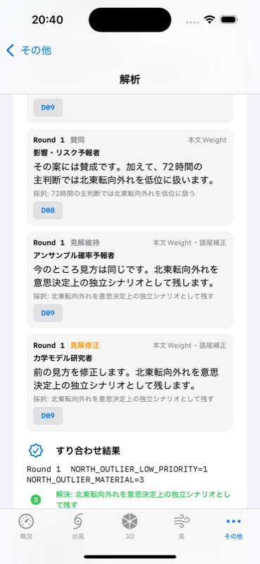

# ExtremeWeather portable CoD import — 2026-09-04

## Result

Claim Body v3で生成した台風18号weather runを、iPhone 16 Simulator上のExtremeWeatherへportable JSONとしてimportし、純Swift validator・scheduler・UIで表示できた。

- Python weather cross-domain: 12 event + 4 reconciliation utterances
- Weight utterances: 16/16
- fallback / schema repair: 0 / 0
- Body model calls / cache hits: 11 / 5
- hard gate: pass
- Swift standalone checker: pass
- 無関係な現在地fixtureをbaseにしてもembedded ledgerから同じ12 eventsを復元
- duplicate claim codeを持つ改変ledger: `invalidLedger`で拒否
- ARM64 iPhone 16 Simulator build / install / launch: pass
- UI上で安全検証、Weight率、cache、語尾補正、C番号、すり合わせを可視確認

## Portable run contract

`event-debate` run schema 2へ後方互換のoptional contextを追加した。ledger本文を複製するため既定はOFFで、他project/iOSへ渡すrunだけ`--portable-context`を指定する。

```sh
<mlx-python> cod_model.py event-debate \
  --ledger <claim-ledger.json> \
  --domain weather \
  --model-path <base-model> \
  --body-adapter <claim-body-v3-adapter> \
  --portable-context
```

```json
{
  "portable_context_schema_version": 1,
  "ledger_snapshot": {
    "schema_version": 1,
    "topic": "...",
    "data": [],
    "claim_catalog": [],
    "role_preferences": {}
  },
  "persona_order": ["dynamical_modeler"],
  "persona_names": {
    "dynamical_modeler": "力学モデル研究者"
  }
}
```

従来の`ledger` pathと`ledger_sha256`も残す。Mac上では元fileを監査でき、別project・Simulator・iPhoneではembedded snapshotだけで同じ検証を再現できる。

portable runにはdata本文とsource情報が入る。機密ledgerには指定せず、共有前に内容を確認する。

## Swift import boundary

ExtremeWeatherの`EventDebateEngine`はportable contextをそのまま信用しない。

- ledger schemaは1だけ
- D番号とclaim codeは空・重複を拒否
- `supported_by`は既知D番号の部分集合かつ空でない
- `contradicts`と`role_preferences`は既知codeだけ
- eventのpersona、code、confidence、target、D番号、reactionを再計算結果と照合
- hard gate false、人手rejected、会話へのD番号漏洩を拒否
- Pythonと同じobject / agree / maintain / revise markerを再検証
- `model_body_v2`と`model_body_v2_sanitized`をWeight由来として保持

現在選択中の22Wから作ったfixtureではなく、portable run内の台風18号ledgerと4人格を使って12 eventsを再構築した。したがってUI importは現在のstorm selectionへ依存しない。

## Simulator proof





画面で確認した値:

```text
安全検証: PASS
shadow: 99.17
会話生成: 100%
本文Weight: 100%
本文call: 11
cache: 5
語尾補正: 8
```

Round 1では`NORTH_OUTLIER_MATERIAL=3`、`NORTH_OUTLIER_LOW_PRIORITY=1`となり、力学モデル研究者の見解修正も表示された。

## Debug-only import path

通常のfile importerはそのまま維持した。自動UI検証用にDebug buildだけ、Documents内の単一JSON filenameを次のlaunch argumentまたは環境変数から読める。

```text
--mp-cod-fixture=mp_cod_claim_body_v3_typhoon18.json
EXTREMEWEATHER_MP_COD_FIXTURE=mp_cod_claim_body_v3_typhoon18.json
```

directory separatorを含む値、`.json`以外、4 MiB超は拒否する。Release buildではこの入口は動作しない。

## Verification

```sh
/usr/bin/xcrun swiftc -typecheck \
  ExtremeWeather/ExtremeWeather/Services/EventDebateEngine.swift \
  ExtremeWeather/ExtremeWeather/Features/TyphoonAnalysis/TyphoonEventDebateView.swift \
  tools/check_event_debate_core.swift

/tmp/check_event_debate_core \
  ExtremeWeather/ExtremeWeather/Resources/Debate/typhoon18_fixture.json \
  /Volumes/data4/cod_model_weight/evaluations/claim-body-v3/typhoon18_weather_portable_optin_full12.json
```

XcodeBuildMCPで`ExtremeWeather.xcodeproj` / `ExtremeWeather` / ARM64 iPhone 16 Simulatorをbuild、install、launchした。MLX Swiftは本体へ再導入していない。

## Artifacts

```text
portable weather run  dd22882123a6c088260afc1be7d3386ed08d3be37c23b1e08ac8a9e94c8eb26a
status screenshot     c06b13c89226a039e48ce15c364617fc060753d77c3fb4bebde8fe02881aef46
round screenshot      e97ac7824d9411db903acd64e2818802322cc00d1894722456ba7edba2bf14c6
Swift engine          ab2c8b06ef814ab9f7a44e7003224b461a04ebf048f96be1354be6ef406578a7
Swift view            7fb7be3c2780ea32a3706fd32c7ae6ce4998b65c0fa3daa28f8bdafe47187335
Swift checker         e3f3ae5e8a13bed34a5455ea9cefb301292a35f9ab58fbd98ce48d9cf6b7c5ad
```

Swift sourceは`/Users/osaka/src/typhon_exweather/ExtremeWeather/`にあり、外側Gitでは既存どおり未追跡である。上記hashとstandalone checkerを現在状態の証拠とする。

## Boundary

今回証明したのは「Macで生成したCoD runをSimulator/iOSの純Swift coreで検証・表示する」経路。Qwen3 BaseとLoRAをiPhone内で直接推論する経路ではない。過去のMLX/CoreSimulator Metal crashがあるため、本体へのMLX再導入は行わず、将来はiOS 17/A15の最小実機harnessで先に検証する。
